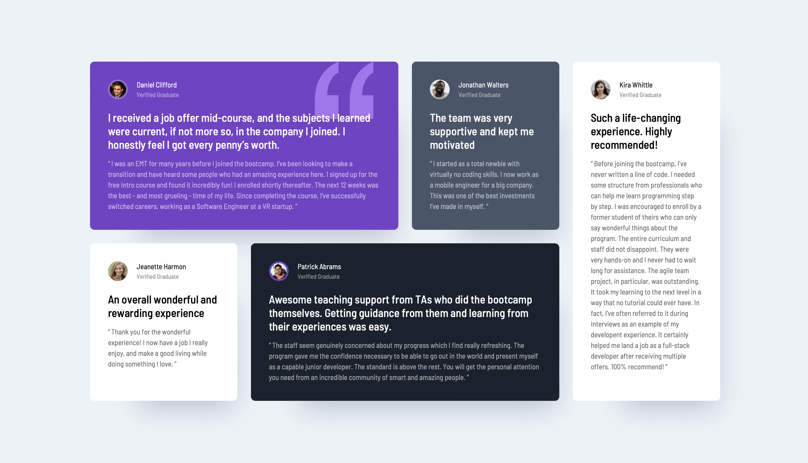

# Frontend Mentor - Testimonials grid section solution

This is a solution to the [Testimonials grid section challenge on Frontend Mentor](https://www.frontendmentor.io/challenges/testimonials-grid-section-Nnw6J7Un7). Frontend Mentor challenges help you improve your coding skills by building realistic projects.

## Table of contents

- [Overview](#overview)
  - [The challenge](#the-challenge)
  - [Screenshot](#screenshot)
  - [Links](#links)
- [My process](#my-process)
  - [Built with](#built-with)
  - [What I learned](#what-i-learned))
- [Author](#author)

## Overview

Responsive Testimonial Section Built With CSS Grid

### The challenge

Users should be able to:

- View the optimal layout for the site depending on their device's screen size

### Screenshot

#### DESKTOP:



#### MOBILE:


### Links

- Solution URL: [View Project](https://carson-haskell.github.io/grid-testimonials/)

## My process

First I built the skeleton of the page with semantic HTML, then, going with a mobile-first approach, I began constructing the grid using CSS. After the mobile layout was complete, I began to add complexity, adjusting the grid layout for desktop devices. After the grid layout was finished and responsive, I began working on the styling, moving from the big stuff to the smaller stuffj.

### Built with

- Semantic HTML5 markup
- CSS custom properties
- Flexbox
- CSS Grid
- Mobile-first workflow

### What I learned

CSS grid is incredible for building complex, responsive layouts. I learned how to utilize `grid-template-areas` to make incredibly flexible layouts, making it a breeze to move things around as needed. Using this simple setup:

```css
.grid-container {
  display: grid;
  gap: 1.5rem;
  grid-auto-columns: 1fr;
  grid-template-areas:
    "card-1"
    "card-2"
    "card-3"
    "card-4"
    "card-5";

  padding-block: 2rem;
  margin-inline: auto;
  width: min(95%, 70rem);
}
```

All I needed to do was rearrange the layout in a media query:

```css
@media screen and (min-width: 70em) {
  .grid-container {
    grid-template-areas:
      "card-1 card-1 card-2 card-5"
      "card-3 card-4 card-4 card-5";
  }
}
```

And just like that, you have two totally different layouts for mobile and web, both fully responsive. It truly is a beautiful thing!

Also took advantage of CSS psuedo selectors to make styling the grid easier.

### Useful resources

- [Josh Comeau CSS Grid](https://www.joshwcomeau.com/css/interactive-guide-to-grid/) - If you haven't heard of Josh Comeau, you should check out his stuff. He explains things in a brilliant yet simple way. After reading this interactive explanation of CSS grid, I felt like I had such a better understanding of how it works.

## Author

- Website - [Carson Haskell](https://portfolio-website-sandy-alpha-78.vercel.app/)
- Frontend Mentor - [@carson-haskell](https://www.frontendmentor.io/profile/carson-haskell)
